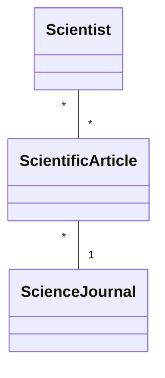
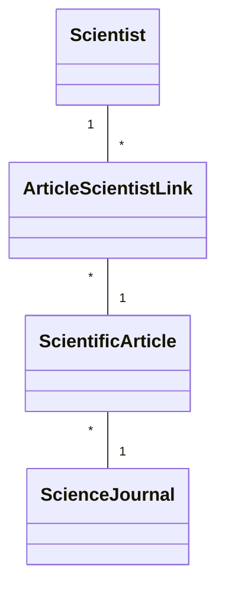

# Scientific Article Management - Project .NET Framework

* Naam: Akshat Verma
* Studentennummer: 0171120-12
* Academiejaar: 24-25
* Klasgroep: ISB204B
* Onderwerp: Scientist * - * Scientific article * - 1 Science Journal

## Sprint 1



## Sprint 3

### Beide zoekcriteria ingevuld

```sql
 SELECT "s"."ScientistId", "s"."DateOfBirth", "s"."Faculty", "s"."Name", "s"."University"
 FROM "Scientists" AS "s"
 WHERE "s"."DateOfBirth" = @__dateOfBirth_0
   AND instr(lower("s"."Name"), @__ToLower_0) > 0
```

### Enkel zoeken op naam

```sql
SELECT "s"."ScientistId", "s"."DateOfBirth", "s"."Faculty", "s"."Name", "s"."University"
FROM "Scientists" AS "s"
WHERE instr(lower("s"."Name"), @__ToLower_0) > 0
```

### Enkel zoeken op geboortedatum

```sql
SELECT "s"."ScientistId", "s"."DateOfBirth", "s"."Faculty", "s"."Name", "s"."University"
FROM "Scientists" AS "s"
WHERE "s"."DateOfBirth" = @__dateOfBirth_0
```

### Beide zoekcriteria leeg

```sql
SELECT "s"."ScientistId", "s"."DateOfBirth", "s"."Faculty", "s"."Name", "s"."University"
FROM "Scientists" AS "s"
```

## Sprint 4



## Sprint 6

### Nieuwe science journal

#### Request

```http request
POST https://localhost:7176/api/ScienceJournals HTTP/1.1
Accept: application/json
Content-Type: application/json

{"name":"Bio+", "price":null, "yearFounded": 2012, "countryOfOrigin": 4}
```

#### Response

```http request
HTTP/1.1 201 Created
Content-Type: application/json; charset=utf-8
Date: Sun, 29 Dec 2024 01:00:11 GMT
Server: Kestrel
Location: https://localhost:7176/api/ScienceJournals/6
Transfer-Encoding: chunked

{
  "id": 6,
  "name": "Bio+",
  "price": null,
  "yearFounded": 2012,
  "countryOfOrigin": 4,
  "articles": []
}
```

## Sprint 7

### Gebruikers

<table>
    <thead>
    <tr>
        <th></th>
        <th>Rol</th>
        <th>Email</th>
        <th>Wachtwoord</th>
    </tr>
    </thead>
    <tbody>
    <tr>
        <th>1</th>
        <td>user</td>
        <td>default.user@kdg.be</td>
        <td>DefaultUser123!</td>
    </tr>
    <tr>
        <th>2</th>
        <td>user</td>
        <td>bob@kdg.be</td>
        <td>Bob123!</td>
    </tr>
    <tr>
        <th>3</th>
        <td>user</td>
        <td>marley@kdg.be</td>
        <td>Marley123!</td>
    </tr>
    <tr>
        <th>4</th>
        <td>user</td>
        <td>ross@kdg.be</td>
        <td>Ross123!</td>
    </tr>
    <tr>
        <th>5</th>
        <td><em>admin</em></td>
        <td>de.bouwer@kdg.be</td>
        <td>DeBouwer123!</td>
    </tr>
    </tbody>
</table>


### Web API

#### Niet als aangemelde gebruiker

###### Request
```http request
POST https://localhost:7176/api/ScienceJournals HTTP/1.1
Accept: application/json
Content-Type: application/json

{"name":"Bio+", "price":null, "yearFounded": 2012, "countryOfOrigin": 4}
```

###### Response
```http request
HTTP/1.1 401 Unauthorized
Content-Length: 0
Date: Sun, 23 Feb 2025 14:06:31 GMT
Server: Kestrel
Location: https://localhost:7176/Identity/Account/Login?ReturnUrl=%2Fapi%2FScienceJournals

<Response body is empty>
```

#### Wél als aangemelde gebruiker

###### Request
```http request
POST https://localhost:7176/api/ScienceJournals HTTP/1.1
Accept: application/json
Content-Type: application/json
Cookie: .AspNetCore.Identity.Application=CfDJ8IyEH_NxhK1FmLPBzcQPeCCp460htM7Pv_6htv_UhibvYjV8PVisDEnBnFtftdNodbX4AUzBmCLVzjBV81V8VME6Dq32k4-_q5piumNI-RY5I4YEFV6nFtP5qVnUQ24dtWkfTMy_nLzFZZXYNzgXXXKyiy84Iq3mzcJOi_tQ7D-cdSgL_SpHF_OhD5WR8hGY6G-9FaBfZnWasYQIYg1J3JPKzq07FXvBjOxMFZ1HunNL-t6yBZkZLzsTUFp2wGIZo615j8FK6499j-nhrnihas4lgfyIGNjbjR-0K28qPKsUIRLOJmGFBXRC2ztYdWjDiNHUcPKoS4Mrs8ZmDZcS4a5P40sTwRlQ4dcnHRj-3qbY9KUYGW6xEMxVRzh8A3ZmQn8F_oN1fcLYKRtHNEMbuoIsTyO6mGFp9aEeqdXE9gLfmBfHwuxlwkT3G0w3YzepqCIrBapxHiLTy2uzy3zR-pTbEcDsQRYL7g1XKwuyy_aXD_eEm-1xu40KX8WJPx7jj6oeResBmCYBeoilihWyCr-m3BtNq99v-AjAWyi7NWPWLYvBVKEXI73IpEK2mNLIm8_vzKR78hQ8aYnvBKepPeCtmhUehV3usFTr66KOYbstGjYRmkGNG3zHVgaKln-5kmabJR_IDqKBygohGmFxqshdEPTjfsQga9ySw-HfQdSwzKZEFFhqx7IgEjC5r3tYZ9wigbxTVZo8ds-OrsRQkqQx9ouxopW0oDom0GvGMKnr2Nkqt9VqfBiJKGNgqZA8r4VO1H43xLBqXox-XJYxLhOnORfpXDreM-vtTC5JXbpr_8y_5uShfYc8UlXLu82GmkPFPiwfNs4-PGwlyyt2R3c

{"name":"Bio+", "price":null, "yearFounded": 2012, "countryOfOrigin": 4}
```

###### Response
```http request
HTTP/1.1 201 Created
Content-Type: application/json; charset=utf-8
Date: Sun, 23 Feb 2025 14:06:18 GMT
Server: Kestrel
Location: https://localhost:7176/api/ScienceJournals/6
Transfer-Encoding: chunked

{
  "id": 6,
  "name": "Bio+",
  "price": null,
  "yearFounded": 2012,
  "countryOfOrigin": 4,
  "articles": []
}
```