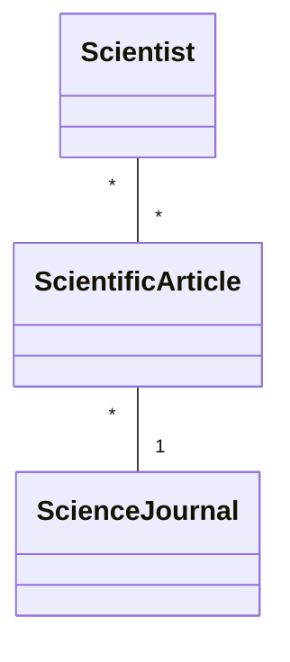
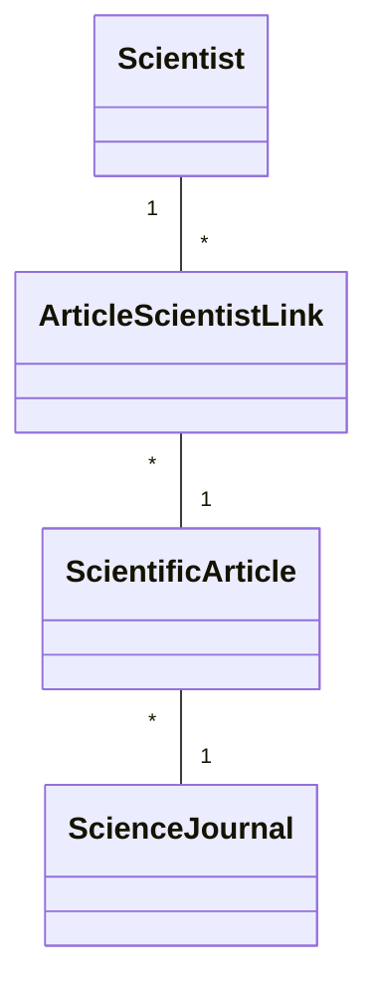

# Scientific Article Management - Project .NET Framework

* Naam: Akshat Verma
* Studentennummer: 0171120-12
* Academiejaar: 24-25
* Klasgroep: ISB204B
* Onderwerp: Scientist * - * Scientific article * - 1 Science Journal


## Sprint 1



## Sprint 3

### Beide zoekcriteria ingevuld
```sql
 SELECT "s"."ScientistId", "s"."DateOfBirth", "s"."Faculty", "s"."Name", "s"."University"
 FROM "Scientists" AS "s"
 WHERE "s"."DateOfBirth" = @__dateOfBirth_0 AND instr(lower("s"."Name"), @__ToLower_0) > 0
```

### Enkel zoeken op naam
```sql
SELECT "s"."ScientistId", "s"."DateOfBirth", "s"."Faculty", "s"."Name", "s"."University"
FROM "Scientists" AS "s"
WHERE instr(lower("s"."Name"), @__ToLower_0) > 0
```

### Enkel zoeken op geboortedatum
```sql
SELECT "s"."ScientistId", "s"."DateOfBirth", "s"."Faculty", "s"."Name", "s"."University"
FROM "Scientists" AS "s"
WHERE "s"."DateOfBirth" = @__dateOfBirth_0
```

### Beide zoekcriteria leeg
```sql
SELECT "s"."ScientistId", "s"."DateOfBirth", "s"."Faculty", "s"."Name", "s"."University"
FROM "Scientists" AS "s"
```

## Sprint 4



## Sprint 6

### Nieuwe science journal

#### Request

```http request
POST https://localhost:7176/api/ScienceJournals HTTP/1.1
Accept: application/json
Content-Type: application/json

{"name":"Bio+", "price":null, "yearFounded": 2012, "countryOfOrigin": 0}
```

#### Response

```http request
HTTP/1.1 201 Created
Content-Type: application/json; charset=utf-8
Date: Fri, 27 Dec 2024 01:26:32 GMT
Server: Kestrel
Location: https://localhost:7176/api/ScienceJournals/3
Transfer-Encoding: chunked

{
  "id": 3,
  "name": "Bio+",
  "price": null,
  "yearFounded": 2012,
  "countryOfOrigin": 0,
  "articles": []
}
```
