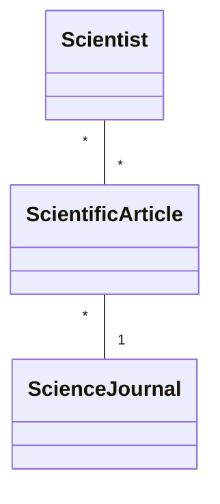

# Science Journal Catalogue - Project .NET Framework

* Naam: Akshat Verma
* Studentennummer: 0171120-12
* Academiejaar: 24-25
* Klasgroep: ISB204B
* Onderwerp: Scientist * - * Scientific article * - 1 Science Journal


## Sprint 1



## Sprint 3

### Beide zoekcriteria ingevuld
```sql
 SELECT "s"."ScientistId", "s"."DateOfBirth", "s"."Faculty", "s"."Name", "s"."University"
 FROM "Scientists" AS "s"
 WHERE "s"."DateOfBirth" = @__dateOfBirth_0 AND instr(lower("s"."Name"), @__ToLower_0) > 0
```

### Enkel zoeken op naam
```sql
SELECT "s"."ScientistId", "s"."DateOfBirth", "s"."Faculty", "s"."Name", "s"."University"
FROM "Scientists" AS "s"
WHERE instr(lower("s"."Name"), @__ToLower_0) > 0
```

### Enkel zoeken op geboortedatum
```sql
SELECT "s"."ScientistId", "s"."DateOfBirth", "s"."Faculty", "s"."Name", "s"."University"
FROM "Scientists" AS "s"
WHERE "s"."DateOfBirth" = @__dateOfBirth_0
```

### Beide zoekcriteria leeg
```sql
SELECT "s"."ScientistId", "s"."DateOfBirth", "s"."Faculty", "s"."Name", "s"."University"
FROM "Scientists" AS "s"
```

